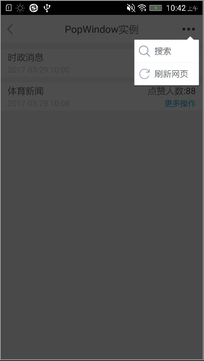
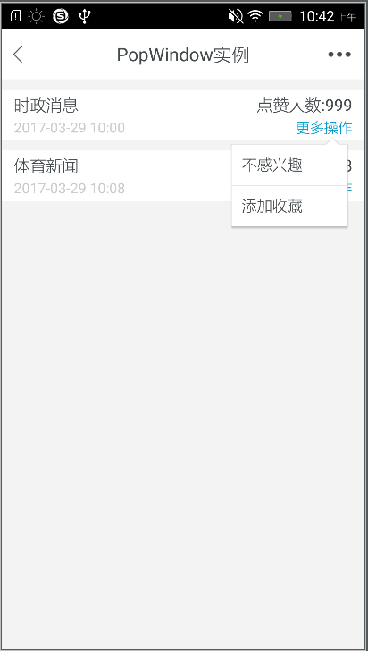
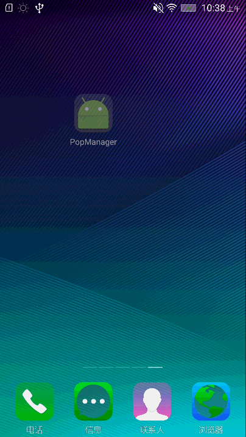

# PopManager
PopWindow实现下拉菜单项,包装了一个通用组件，使用者也可以根据需求，自定义View。

# Gradle

	compile 'com.xyzlf.poplib:popcommon:0.0.1'

# 效果图

# 使用方式

	private void showMenuPop(View menuView) {
        PopModel feedPopModel = new PopModel();
        feedPopModel.setDrawableId(R.drawable.icon_search);
        feedPopModel.setItemDesc("搜索");

        PopModel messagePopMode = new PopModel();
        //如果设置了图标，则会显示，否则不显示
        messagePopMode.setDrawableId(R.drawable.icon_refresh);
        messagePopMode.setItemDesc("刷新网页");

        /** 初始化数据源 **/
        final List<PopModel> list = new ArrayList<>();
        list.add(feedPopModel);
        list.add(messagePopMode);

        PopCommon popCommon = new PopCommon(this, list, new PopCommon.OnPopCommonListener() {
            @Override
            public void onItemClick(AdapterView<?> parent, View view, int position, long id) {
                Toast.makeText(MainActivity.this, "点击了：" + list.get(position).getItemDesc(), Toast.LENGTH_LONG).show();
            }

            @Override
            public void onDismiss() {

            }
        });
        /** 是否显示黑色背景，默认不显示 **/
        popCommon.setShowAplhaWindow(true);
        popCommon.showPop(menuView, dp2px(getApplicationContext(), 5), menuView.getHeight() / 4 * 5);
    }

# 关于我
有任何使用问题，可以给我发邮件：

Author：张利峰

E-mail：519578280@qq.com

# License

    Copyright(c)2017 xyzlf Open Source Project
    
    Licensed under the Apache License, Version 2.0 (the "License");
    you may not use this file except in compliance with the License.
    You may obtain a copy of the License at
    
    http://www.apache.org/licenses/LICENSE-2.0
    
    Unless required by applicable law or agreed to in writing, software
    distributed under the License is distributed on an "AS IS" BASIS,
    WITHOUT WARRANTIES OR CONDITIONS OF ANY KIND, either express or implied.
    See the License for the specific language governing permissions and
    limitations under the License.